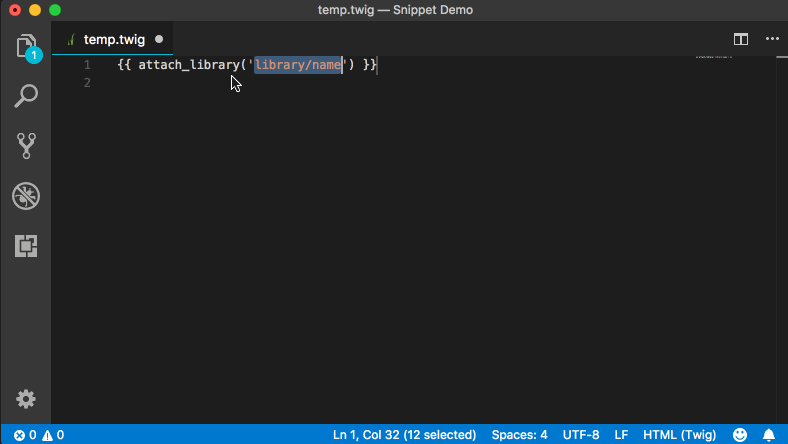
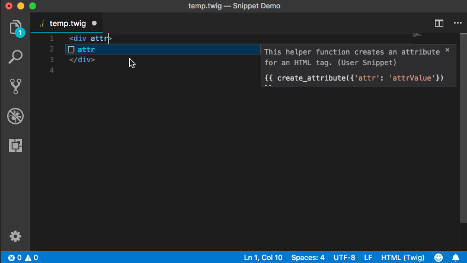
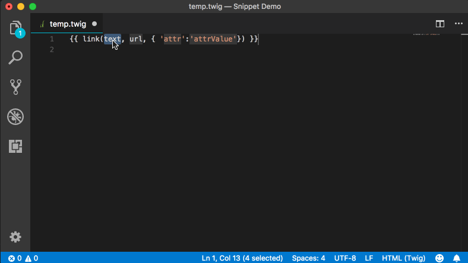
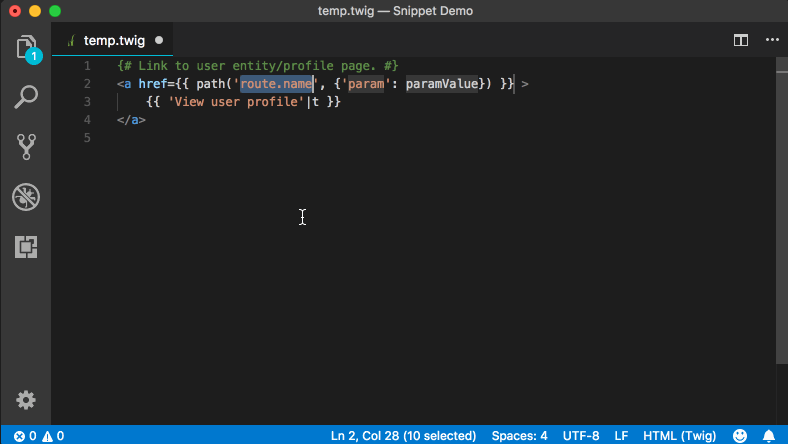
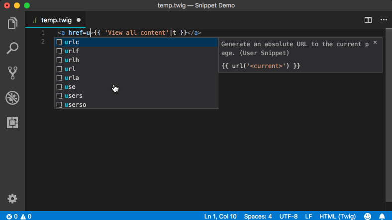
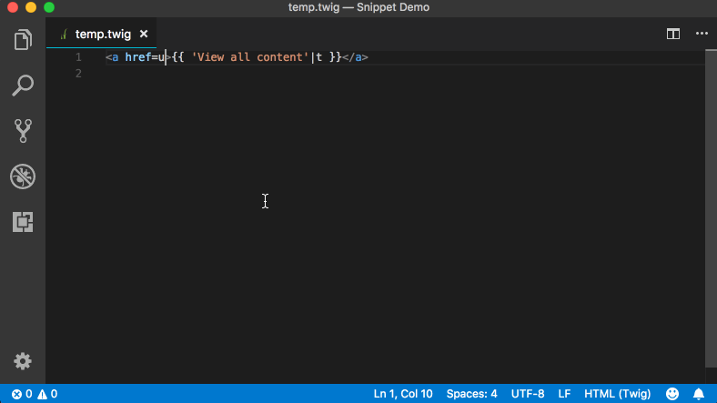

# Drupal 8 Twig snippets for Visual Studio Code

This extension adds 8 useful twig snippets that can be used with Drupal 8. These snippets were extracted from the [Functions - in Twig Templates](https://www.drupal.org/docs/8/theming/twig/functions-in-twig-templates) documentation.

## Installation

To install this extension use the following steps:

1. In VS Code, open the **Command Palette** using the shortcut key combination `ctrl-shift-p` (Windows, Linux) or `cmd-shift-p` (OSX)
1. Then in the Command Palette box, type in `Install Extensions` and select that form the list.
1. This will open up the **Extension Manager**. In the search box type in `Drupal 8 Twig Snippets`.
1. Click the **Install** button, after that finishes make sure to reload VS Code as well.

## Usage

Once installed, to use these snippets you can use the following two methods, the first Method is geared towards people who are new to the snippets available while the second method is suitable for people who know the available snippets and are looking to increase their speed.

### Method 1
1. Open the **Command Palette**, `ctrl-shift-p` (Windows, Linux) or `cmd-shift-p` (OSX)
1. In the command box type in `Insert Snippet`; this will list all the available snippets.
1. Select the snippet you want to use from the provided list.

### Method 2
1. In the code editor window, type in the **Prefix** of the snippet you want to insert. This will show an intellisense window as you type.
1. Insert the snippet you want by simply pressing the `tab` key.

## Features

Here you will find all the code snippets that are available in this extension. Please note that each title starts with the **Prefix** of the code snippet to insert; useful to memorize them if you plan to use [Method 2](#Method-2) above.

### lib - attach_library($library)

Attaches an asset library to the template.

Example:
```twig
{{ attach_library('classy/node') }}
```



### attr - create_attribute($attributes)

Creates an attribute on a DOM element.

Example:
```twig
<div{{ create_attribute({'class': ['region', 'region--header']}) }}>
  {{ content }}
</div>
```



### furl - `file_url($uri)`

This helper function accepts a **relative path** from the root and creates a relative URI path to the file.

Example:
```twig
{{ file_url(node.field_example_image.entity.uri.value) }}
```


### lnk - `link($text, $url, $attributes)`

This helper function accepts as first parameter the **text**, as second parameter the **url** and as third paramter any **attributes** for the link.

Example:
```twig
{{ link(item.title, item.url, { 'class':['foo', 'bar', 'baz']} ) }}
```




### path - `path($name, $parameters, $options)`

Generates a **relative** URL path given a route name and parameters.

Example:
```twig
{# Link to user entity/profile page. #}
<a href="{{ path('entity.user.canonical', {'user': user.id}) }}">{{ 'View user profile'|t }}</a>
```



### urlh - `url($name, $parameters, $options)`

Generate an absolute URL given a route name and parameters.

Example:
```twig
<a href="{{ url('view.frontpage.page_1') }}">{{ 'View all content'|t }}</a>
```



### urlc - `url('<current>')`

Generate an absolute URL to the current url.

Example:
```twig
<a href="{{ url('<current>') }}">{{ 'View all content'|t }}</a>
```



### urlf - `url('<front>')`

Generate an absolute URL to the front page.

Example:
```twig
<a href="{{ url('<front>') }}">{{ 'View all content'|t }}</a>
```


### Requirements

These snippets are only made available in files with a `.twig` extension. To get proper support for Twig files in Visual Studio Code, you can install the [Twig Language 2](https://marketplace.visualstudio.com/items?itemName=mblode.twig-language-2) extension by *mblode*.

## Release Notes
### 1.0.2

Fix typos in README

### 1.0.1

Added the Drupal 8 logo
### 0.0.1

Initial release
